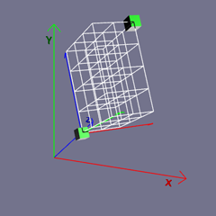

Happy Babylon Games!

# Notes (From official doc)

## Mesh
- Whether you are creating a whole world or just placing one model into a web page you need a scene to contain the world or model, a camera to view it, a light to illuminate it and, of course, at least one viewable object as a model. All models, whether just a box or a complex character, are made from a mesh of triangles or facets.
- A large number of meshes can be created directly within Babylon.js using code, or, as you will shortly see, imported as models from meshes created with other software. Let us start simply with a box.
- Examples on these pages can be viewed in the playground, the place to try out Babylon.js live on the web, by clicking on their titles. To edit the code open them with

## Engine
- All projects using the Babylon.js Engine need a scene with a camera and a light added. Then we can create our box.
- Wait...what is the Babylon.js Engine you ask? Excellent question. The engine variable seen below is the class that's responsible for interfacing with lower-level APIs such as WebGL, Audio, etc. The constructor to create a Babylon scene (the context that renders visuals to the screen) needs the engine to talk to these lower level APIs. This is why the engine variable is needed when creating a scene.
- You can read more about the engine class here.

## Coordinate system
- ←(-) →(+) width (x) (vertical),  ↑(+) ↓(-) height (y) (vertical), ↑(+) ↓(-) depth (z) (Horizon)



## Internal colors

```javascript
BABYLON.Color3.Red();
BABYLON.Color3.Green();
BABYLON.Color3.Blue();
BABYLON.Color3.Black();
BABYLON.Color3.White();
BABYLON.Color3.Purple();
BABYLON.Color3.Magenta();
BABYLON.Color3.Yellow();
BABYLON.Color3.Gray();
BABYLON.Color3.Teal();
```